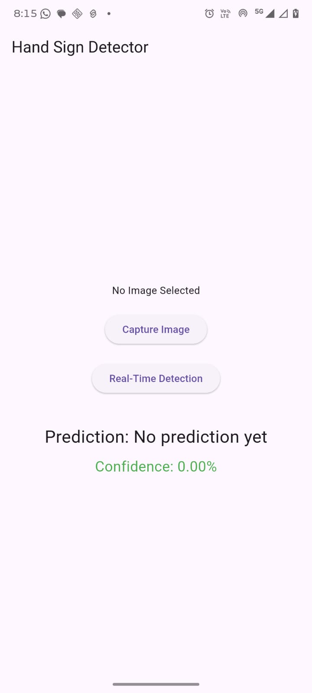

# Hand Sign Detection

Real-time hand sign detection mobile application built using Flutter and TensorFlow Lite.

## Features
- Real-time sign detection
- Camera integration
- TensorFlow Lite model
- Mobile-friendly UI

## Tech Stack
- Flutter
- Dart
- TensorFlow Lite
- FastAPI
- Python

## Screenshots

## Home Screen

## Detection Screen

## Result Screen

