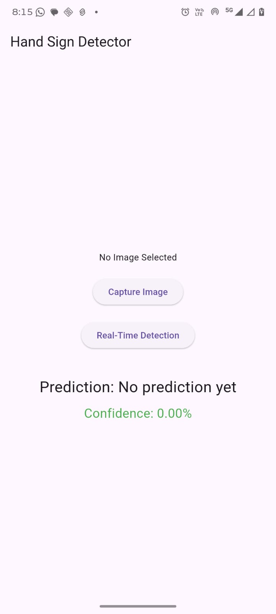
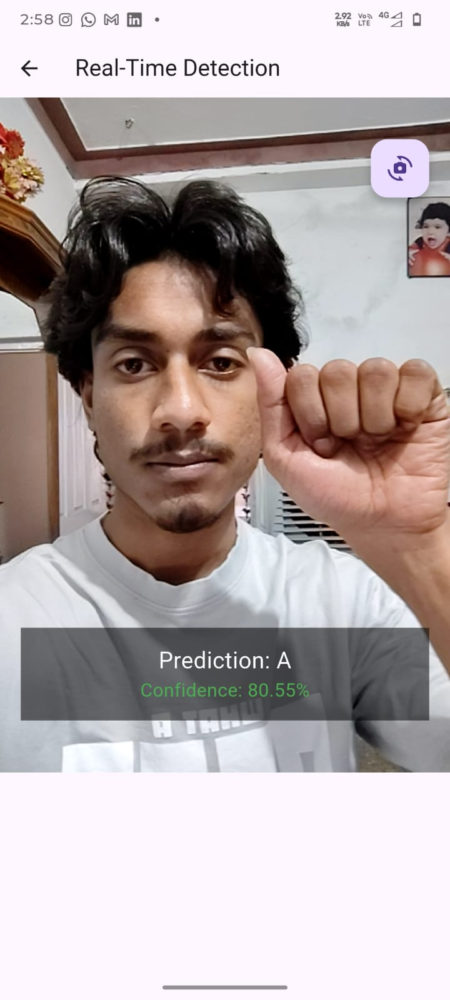
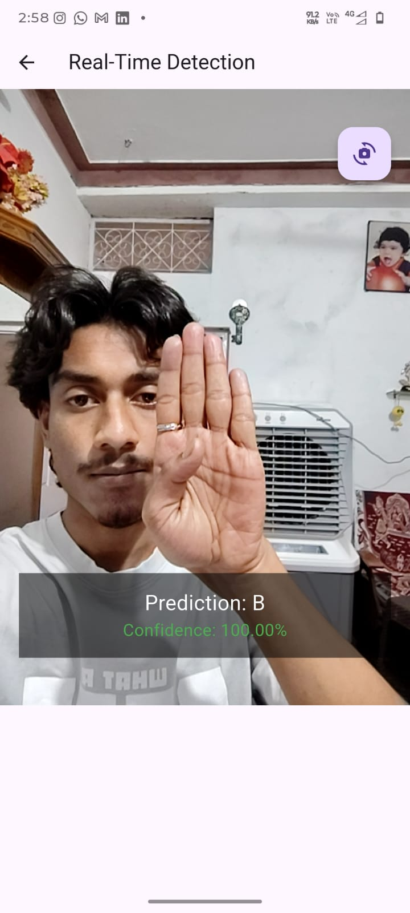
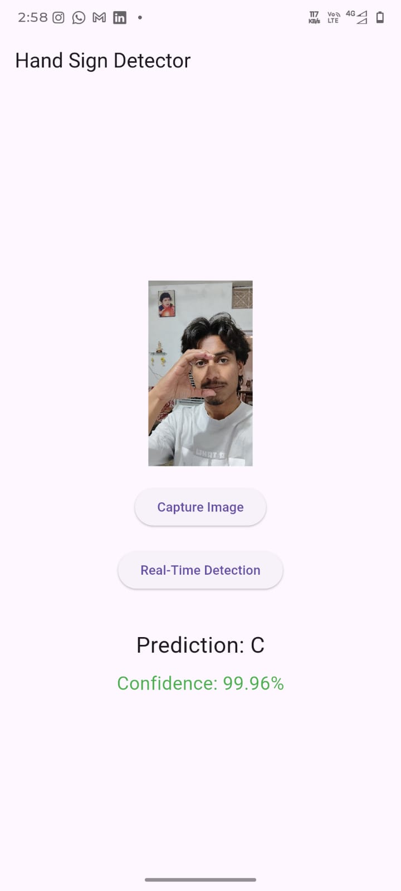

# Hand Sign Detection

A Flutter-based Android application that detects hand signs using a custom-trained TensorFlow Lite model.

## Features

- Real-time hand sign detection using the device camera
- Hand sign prediction from uploaded images
- Custom hand-sign dataset
- TensorFlow Lite on-device inference
- Text-to-speech output
- Simple and user-friendly interface

## Tech Stack

- Flutter
- Dart
- TensorFlow Lite
- Teachable Machine
- Camera
- Image Picker
- Text-to-Speech (TTS)

## How It Works

1. A custom hand-sign dataset is created and used to train the model in Teachable Machine.
2. The trained model is exported in TensorFlow Lite format.
3. The `.tflite` model is integrated into the Flutter application.
4. The app receives an image from the camera or gallery.
5. The image is processed and passed to the TensorFlow Lite model.
6. The model predicts the hand sign.
7. The predicted result is displayed and can be converted to speech.

## Machine Learning Model

The hand-sign detection model was trained using a custom dataset in Teachable Machine.

The trained model was exported as a TensorFlow Lite (`.tflite`) model and integrated into the Flutter application using the `tflite_flutter` package.

The application performs model inference on the device to predict the detected hand sign.

## Project Structure

```text
hand-sign-detection/
├── android/
├── assets/
│   ├── model.tflite
│   └── labels.txt
├── lib/
├── screenshots/
├── test/
├── pubspec.yaml
└── README.md
```

## Screenshots

### Home Screen



### Real-Time Detection



### Detection Result



### Image Upload Detection



## Key Learnings

- Flutter application development
- TensorFlow Lite model integration
- Custom dataset preparation
- Model training using Teachable Machine
- Camera and image input handling
- On-device model inference
- Text-to-speech integration

## Future Improvements

- Improve model accuracy using a larger and more diverse dataset
- Expand the model to recognize more hand signs, including additional alphabets and gestures such as the Victory (✌️) sign
- Improve prediction stability
- Add support for additional languages
